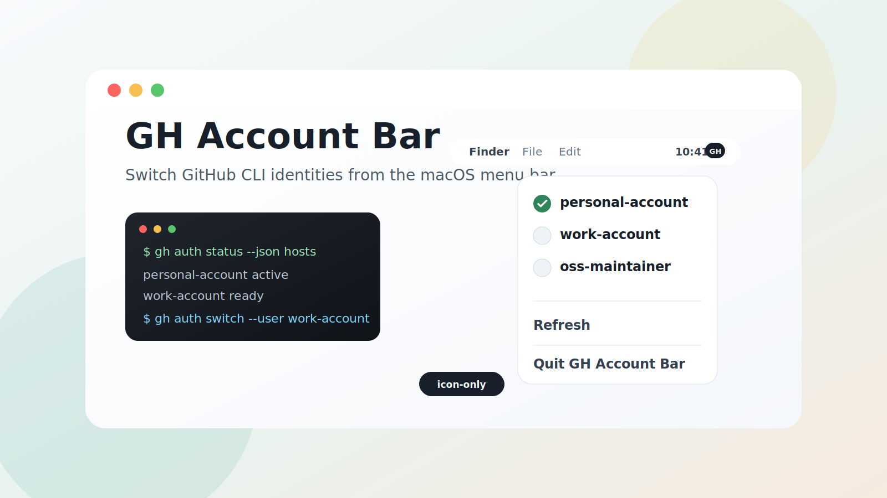
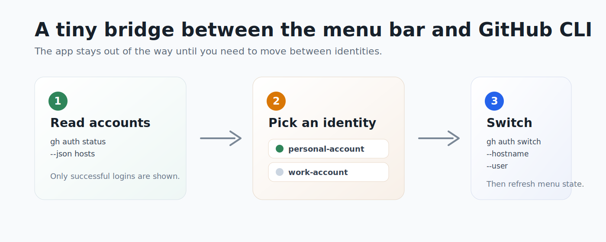

<p align="center">
  
</p>

# GH Account Bar

GH Account Bar is a tiny macOS menu bar app for switching between authenticated GitHub CLI accounts without leaving your current workflow.

It reads accounts from `gh auth status --json hosts`, shows successful logins in a native menu bar dropdown, and switches the selected identity with `gh auth switch`.

## Features

- Native macOS menu bar utility with no Dock icon.
- Icon-only status item with tooltip feedback for the active account.
- Lists every successful authenticated `gh` user, including multiple hosts.
- Disables the active account so accidental no-op switches are obvious.
- Refreshes when the menu opens and on a short polling interval.
- Includes Retry, Refresh, and Quit menu actions.

<p align="center">
  
</p>

## Requirements

- macOS 14 or newer
- Swift 6.3 toolchain
- GitHub CLI installed and authenticated with one or more accounts

Check your CLI auth state before running:

```sh
gh auth status
```

## Build And Run

Run the app bundle locally:

```sh
./script/build_and_run.sh
```

Verify that the bundle launches:

```sh
./script/build_and_run.sh --verify
```

The script builds the Swift package, creates `dist/GHAccountBar.app`, marks it as a menu bar-only app, and opens it.

## Development

Build the executable:

```sh
swift build
```

Run the test suite:

```sh
swift test
```

Run with logs:

```sh
./script/build_and_run.sh --logs
```

## How It Works

The app keeps its core logic small:

- `GHAuthStatusParser` decodes `gh auth status --json hosts` output into account models.
- `GHCommandBuilder` builds the `gh auth switch --hostname <host> --user <login>` invocation.
- The AppKit menu bar runtime renders accounts, refreshes state, and handles selection.

The menu bar title is intentionally empty so the app presents as a compact icon. The active account is exposed through the status item tooltip.

## Project Layout

```text
Sources/GHAccountBar/        AppKit menu bar runtime
Sources/GHAccountBarCore/    Parser, command builder, display policy
Tests/GHAccountBarTests/     Core behavior tests
script/build_and_run.sh      Local app bundle builder and launcher
```
